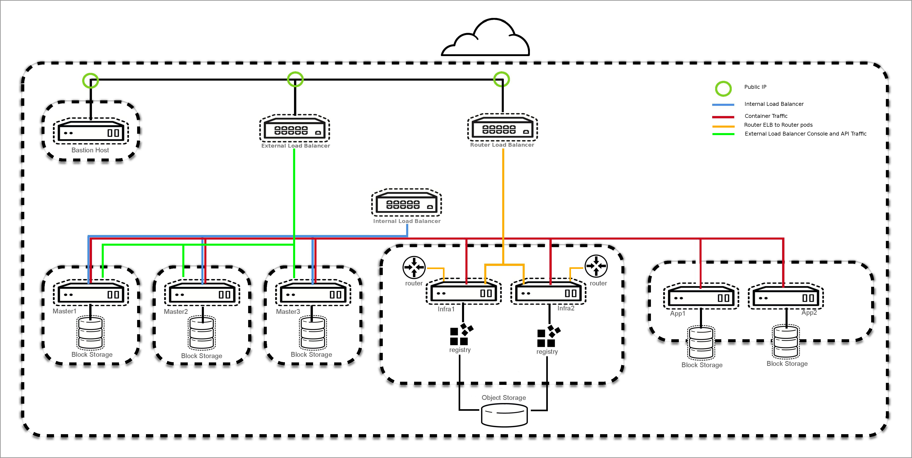

# How to deploy quickly the Reference Architecture OpenShift on Amazon Web Services

The repository contains Vagrantfile to create a VM "console" to perform the deployment of the Reference Architecture Openshift on Amazon Web services.


# Prerequisites

###To perform an installation of OCP on AWS you need:

-  AWS account
-  RedHat account and openshift subscription
-  AWS Route53 domain - example : sysdeseng.com
-  Github account : Authentication for the reference architecture deployment is
handled by GitHub OAuth.


###Install on your machine :

* Virtualbox (I'm using Version 5.1.6 r110634)
* Vagrant (I'm using version 1.8.5)
* Vagrant plugin we need :  

``` 
$ vagrant plugin list
vagrant-registration (1.3.1)
vagrant-timezone (1.1.0)
```
* to install vagrant missing plugin

```
$ vagrant plugin install vagrant-registration
$ vagrant plugin install vagrant-timezone
```

# Getting started

```
$ mkdir test
$ cd TEST
$ git clone https://github.com/dwojciec/ocp-on-aws.git
$ cd ocp-on-aws
```
Update the input.env file with all your own values for DOMAIN, REGION, RHSM,etc....

```
$ cat input.env 
export DOMAIN=<sysdeseng.com>
export SUB_USERNAME=<rhsm-user>
export SUB_PASSWORD=<rhsm-password>
export SUB_POOLID=<rhsm-poolid>
export VM_CPU=1
export VM_MEMORY=1024
export AWS_SECRET_ACCESS_KEY=<AWS_SECRET_ACCESS_KEY>
export AWS_ACCESS_KEY_ID=<AWS_ACCESS_KEY_ID>
export REGION=eu-west-1
export AMI=ami-8b8c57f8
export GITHUB_CLIENT_SECRET=
export GITHUB_ORGANIZATION=
export GITHUB_CLIENT_ID=
```

Update the values using vi

```
$ vi input.env
```

Source the input.env file 

```
$ . ./input.env
```

Verify the input.env file was correctly sourced

```
$ env 

```
Now we are ready to create the VM

```
$ vagrant up 
```

After 10 minutes you will have a RHEL VM 7.2 prepared to perform the Reference Architecture of OCP on AWS. See [here an output file example] (https://raw.githubusercontent.com/dwojciec/ocp-on-aws/master/doc/vagrant-output.txt)  of `vagrant up` to compare.

Performing the OCP installation on AWS

```
$ vagrant ssh
[vagrant@consoleaws ~]$ sudo -i
[root@consoleaws ~]# cd /vagrant
[root@consoleaws vagrant]# . ./input.env
[root@consoleaws vagrant]# cd aws
[root@consoleaws aws]# ./install-ocp-on-aws.sh
```

After less than 1 hour you have a Reference Architecture of OCP deployed on AWS like this 

**3 Masters** in different availability zones, **2 infrastructure nodes** and **2 application nodes**.

## AWS Resources deployed

In the AWS console, check for the following resources:

-  3 Master nodes
-  2 Infrastructure nodes
- 2 Application nodes
- 1 Unique VPC with the required components
- 8 Security groups
- 2 Elastic IPs
- 1 NAT Gateway
- 1 Key pair
- 3 ELBs
- 2 IAM roles
- 2 IAM Policies
- 1 S3 Bucket
- 1 IAM user
- 1 Zones in Route53


# To destroy

you can execute this script `remove-installation.sh` 

```
[root@consoleaws ~]# cd /vagrant/aws
[root@consoleaws ~]# ./remove-installation.sh
ansible-playbook -i inventory/aws/hosts -e 'region=eu-west-1 stack_name=openshift-infra ci=true' playbooks/teardown.yaml
Are you sure you wish to continue? (yes/no)yes
Destroying Installation on AWS...
PLAY [localhost] ***************************************************************

TASK [cfn-outputs : Get cfn stack outputs] *************************************
ok: [localhost]

TASK [cfn-outputs : Set s3 facts] **********************************************
ok: [localhost]

TASK [terminate-all : Force remove s3 bucket] **********************************
changed: [localhost]

TASK [terminate-all : Remove Cloudformation] ***********************************
changed: [localhost]

TASK [terminate-all : lookup up vols] ******************************************
ok: [localhost]

TASK [terminate-all : cleanup] *************************************************
changed: [localhost] => (item={u'status': u'available', u'zone': u'eu-west-1c', u'tags': {}, u'region': u'eu-west-1', u'iops': 100, u'create_time': u'2017-01-05T14:21:41.897Z', u'snapshot_id': u'', u'attachment_set': {u'device': None, u'instance_id': None, u'status': None, u'attach_time': None}, u'type': u'gp2', u'id': u'vol-0740e780f9514eb04', u'size': 5})
changed: [localhost] => (item={u'status': u'available', u'zone': u'eu-west-1c', u'tags': {}, u'region': u'eu-west-1', u'iops': 100, u'create_time': u'2017-01-05T14:21:41.948Z', u'snapshot_id': u'', u'attachment_set': {u'device': None, u'instance_id': None, u'status': None, u'attach_time': None}, u'type': u'gp2', u'id': u'vol-09e967b62aa519f07', u'size': 25})
changed: [localhost] => (item={u'status': u'available', u'zone': u'eu-west-1a', u'tags': {}, u'region': u'eu-west-1', u'iops': 100, u'create_time': u'2017-01-05T14:23:44.120Z', u'snapshot_id': u'', u'attachment_set': {u'device': None, u'instance_id': None, u'status': None, u'attach_time': None}, u'type': u'gp2', u'id': u'vol-088df1a9367ab116d', u'size': 5})
changed: [localhost] => (item={u'status': u'available', u'zone': u'eu-west-1a', u'tags': {}, u'region': u'eu-west-1', u'iops': 100, u'create_time': u'2017-01-05T14:23:44.180Z', u'snapshot_id': u'', u'attachment_set': {u'device': None, u'instance_id': None, u'status': None, u'attach_time': None}, u'type': u'gp2', u'id': u'vol-074368aaf91a655ec', u'size': 25})
changed: [localhost] => (item={u'status': u'available', u'zone': u'eu-west-1b', u'tags': {}, u'region': u'eu-west-1', u'iops': 100, u'create_time': u'2017-01-05T14:21:56.759Z', u'snapshot_id': u'', u'attachment_set': {u'device': None, u'instance_id': None, u'status': None, u'attach_time': None}, u'type': u'gp2', u'id': u'vol-041b048da97d06a6f', u'size': 25})
changed: [localhost] => (item={u'status': u'available', u'zone': u'eu-west-1b', u'tags': {}, u'region': u'eu-west-1', u'iops': 100, u'create_time': u'2017-01-05T14:21:56.694Z', u'snapshot_id': u'', u'attachment_set': {u'device': None, u'instance_id': None, u'status': None, u'attach_time': None}, u'type': u'gp2', u'id': u'vol-034b2679c9a9e72d4', u'size': 5})

PLAY RECAP *********************************************************************
localhost                  : ok=6    changed=3    unreachable=0    failed=0   

[root@consoleaws ~]#
```

# Notes
[The Reference Architecture OpenShift on Amazon Web Services] (https://github.com/openshift/openshift-ansible-contrib/tree/master/reference-architecture/aws-ansible)

[Deploying OpenShift Container
Platform 3 on Amazon Web Services](https://access.redhat.com/articles/2623521)